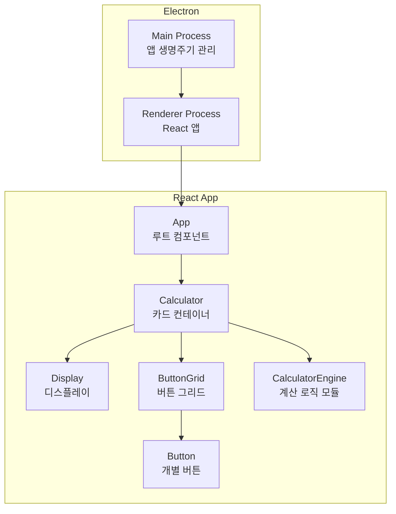
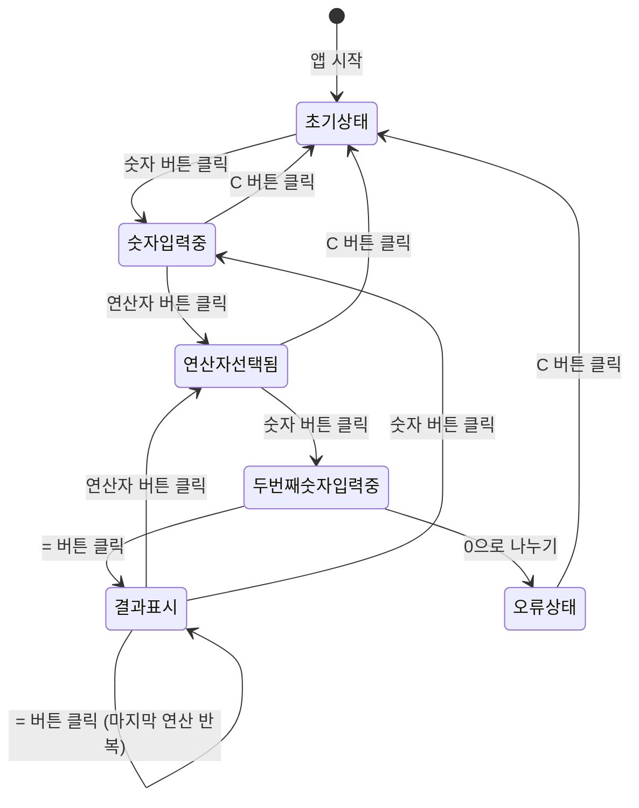
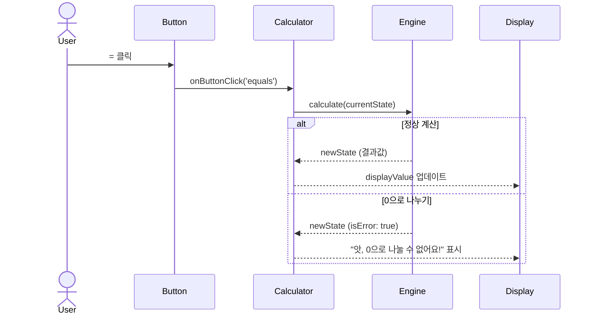

# Tech Spec: 4칙 연산 계산기

---

## 1. 문서 정보

| 항목 | 내용 |
|------|------|
| **작성일** | 2026-03-10 |
| **상태** | Draft |
| **버전** | v0.1 |
| **원문 PRD** | prd.md |
| **작성 배경** | 수업 시연 및 포트폴리오용 4칙 연산 계산기 데스크탑 앱 |

---

## 2. 시스템 아키텍처

### 2-1. 아키텍처 패턴

| 패턴 | 선택 이유 |
|------|-----------|
| 컴포넌트 기반 아키텍처 (Component-Based) | UI를 독립적인 단위로 분리하여 재사용성과 유지보수성 확보 |
| MVC (계산 로직 레이어 분리) | View(React 컴포넌트)와 Model(계산 엔진)을 분리하여 교육적 설명 용이 |

### 2-2. 컴포넌트 구성도



### 2-3. 배포 환경

| 환경 | 도구 | 비고 |
|------|------|------|
| 데스크탑 패키징 | Electron Builder | Windows(.exe) / macOS(.dmg) 빌드 |
| 번들러 | Vite | 빠른 HMR, Electron과 궁합 좋음 |
| CI/CD | GitHub Actions | 자동 빌드 및 릴리즈 |

---

## 3. 기술 스택

| 분류 | 기술 | 버전 | 선정 이유 |
|------|------|------|-----------|
| **런타임** | Electron | 29.x | 웹 기술로 데스크탑 앱 제작, 크로스 플랫폼 |
| **UI 프레임워크** | React | 18.x | 컴포넌트 기반 설계 교육에 최적, 생태계 풍부 |
| **언어** | TypeScript | 5.x | 타입 안전성으로 버그 사전 방지, 코드 가독성 향상 |
| **번들러** | Vite | 5.x | 빠른 개발 환경, Electron-Vite 플러그인 지원 |
| **스타일링** | CSS Modules | — | 별도 라이브러리 없이 컴포넌트 스코프 스타일 관리 |
| **상태 관리** | React useState | — | 외부 라이브러리 불필요, 계산기 수준에 충분 |
| **패키징** | Electron Builder | 24.x | Windows/macOS 설치 파일 자동 생성 |
| **테스트** | Vitest | 1.x | Vite 기반 단위 테스트, 계산 엔진 검증 |
| **린터** | ESLint + Prettier | — | 코드 품질 및 스타일 통일 |

---

## 4. 데이터 모델

### 4-1. 계산기 상태 (TypeScript Interface)

```typescript
// 계산기 전체 상태
interface CalculatorState {
  displayValue: string;       // 디스플레이에 표시되는 현재 값
  expression: string;         // 상단에 작게 표시되는 수식 (예: "12 +")
  firstOperand: number | null;   // 첫 번째 피연산자
  operator: Operator | null;     // 현재 선택된 연산자
  waitingForSecond: boolean;     // 연산자 입력 후 두 번째 숫자 대기 중 여부
  isError: boolean;              // 오류 상태 여부 (예: 0으로 나누기)
  lastOperator: Operator | null; // = 연속 입력 시 반복할 마지막 연산자
  lastOperand: number | null;    // = 연속 입력 시 반복할 마지막 피연산자
}

// 연산자 타입
type Operator = '+' | '-' | '×' | '÷';

// 버튼 타입
type ButtonType = 'number' | 'operator' | 'equals' | 'clear' | 'backspace' | 'decimal';

interface ButtonConfig {
  label: string;       // 화면에 표시되는 텍스트
  type: ButtonType;    // 버튼 종류
  value: string;       // 내부 처리 값
  className?: string;  // 스타일 구분용 (예: 'operator', 'equals')
}
```

### 4-2. 상태 흐름도



---

## 5. API 명세

### 5-1. CalculatorEngine 모듈 인터페이스

```typescript
// src/engine/CalculatorEngine.ts

/**
 * 숫자 입력 처리
 * @param state 현재 계산기 상태
 * @param digit 입력된 숫자 문자 ('0'~'9')
 * @returns 새로운 계산기 상태
 */
function inputDigit(state: CalculatorState, digit: string): CalculatorState

/**
 * 연산자 입력 처리
 * @param state 현재 계산기 상태
 * @param operator 선택된 연산자 ('+' | '-' | '×' | '÷')
 * @returns 새로운 계산기 상태
 */
function inputOperator(state: CalculatorState, operator: Operator): CalculatorState

/**
 * 계산 실행 (= 버튼)
 * @param state 현재 계산기 상태
 * @returns 새로운 계산기 상태 (결과값 또는 Error 상태)
 */
function calculate(state: CalculatorState): CalculatorState

/**
 * 전체 초기화 (C 버튼)
 * @returns 초기 CalculatorState
 */
function clear(): CalculatorState

/**
 * 마지막 자리 삭제 (⌫ 버튼)
 * @param state 현재 계산기 상태
 * @returns 새로운 계산기 상태
 */
function backspace(state: CalculatorState): CalculatorState

/**
 * 소수점 입력 처리
 * @param state 현재 계산기 상태
 * @returns 새로운 계산기 상태
 */
function inputDecimal(state: CalculatorState): CalculatorState
```

### 5-2. 함수별 입출력 예시

| 함수 | 입력 상태 | 입력값 | 출력 상태 (displayValue) |
|------|-----------|--------|--------------------------|
| `inputDigit` | 초기 | `'5'` | `'5'` |
| `inputOperator` | `displayValue: '5'` | `'+'` | `expression: '5 +'` |
| `calculate` | `firstOperand: 5, operator: '+', displayValue: '3'` | — | `'8'` |
| `calculate` | `firstOperand: 5, operator: '÷', displayValue: '0'` | — | `isError: true` |
| `backspace` | `displayValue: '123'` | — | `'12'` |
| `clear` | 임의 상태 | — | `displayValue: '0'` |

---

## 6. 상세 기능 명세

### 6-1. 컴포넌트 트리 및 책임

```
App
└── Calculator              # 카드 컨테이너, 전체 state 관리
    ├── Display             # 수식(expression) + 현재값(displayValue) 표시
    └── ButtonGrid          # 버튼 레이아웃 그리드
        └── Button          # 개별 버튼 (type별 스타일 분기)
```

| 컴포넌트 | Props | 책임 |
|----------|-------|------|
| `Calculator` | 없음 | `CalculatorState` 보유, 엔진 함수 호출, 하위 컴포넌트에 데이터 전달 |
| `Display` | `displayValue`, `expression` | 수식과 현재값 렌더링, 글자 크기 자동 조절 |
| `ButtonGrid` | `onButtonClick` | 버튼 레이아웃 정의 (4×5 그리드) |
| `Button` | `config`, `onClick` | 버튼 렌더링, 클릭 애니메이션, type별 스타일 |

### 6-2. 버튼 레이아웃 (4×5 그리드)

```
[ C  ] [ ⌫ ] [  ] [ ÷ ]
[ 7  ] [ 8 ] [ 9 ] [ × ]
[ 4  ] [ 5 ] [ 6 ] [ - ]
[ 1  ] [ 2 ] [ 3 ] [ + ]
[ 0      ] [ . ] [ = ]
```

### 6-3. 핵심 로직 시퀀스 (= 버튼 클릭)



### 6-4. 엣지 케이스 처리 목록

| 상황 | 처리 방법 |
|------|-----------|
| 초기 상태에서 `C` 클릭 | `clear()` 무시 (이미 초기 상태) |
| 결과 표시 중 `⌫` 클릭 | 무시 |
| 연속 `=` 클릭 | `lastOperator` + `lastOperand`로 반복 계산 |
| 연산자 없이 `=` 클릭 | 무시, 현재 `displayValue` 유지 |
| 소수점 중복 입력 | 무시 |
| 연산자 직후 소수점 | `0.` 으로 자동 시작 |
| 연산자 연속 입력 | 마지막 연산자로 교체 |

---

## 7. UI/UX 스타일 가이드

### 7-1. 디자인 토큰 (CSS Custom Properties)

```css
:root {
  /* 색상 */
  --color-bg: #1a1a2e;           /* 앱 배경 — 딥 네이비 */
  --color-card: #16213e;         /* 계산기 카드 배경 */
  --color-display-bg: #0f3460;   /* 디스플레이 배경 */
  --color-btn-number: #1a1a2e;   /* 숫자 버튼 */
  --color-btn-operator: #e94560; /* 연산자 버튼 — 포인트 레드 */
  --color-btn-equals: #e94560;   /* = 버튼 */
  --color-btn-clear: #533483;    /* C/⌫ 버튼 — 퍼플 */
  --color-text-primary: #ffffff;
  --color-text-secondary: #a8a8b3;
  --color-error: #ff6b6b;

  /* 형태 */
  --radius-card: 24px;
  --radius-btn: 16px;
  --shadow-card: 0 25px 60px rgba(0, 0, 0, 0.5);
  --shadow-btn: 0 4px 15px rgba(0, 0, 0, 0.3);

  /* 간격 */
  --gap-btn: 12px;
  --padding-card: 24px;

  /* 애니메이션 */
  --transition-btn: transform 0.1s ease, box-shadow 0.1s ease;
}
```

### 7-2. 타이포그래피

| 요소 | 폰트 | 크기 | 굵기 |
|------|------|------|------|
| 디스플레이 (결과값) | `'SF Pro Display', sans-serif` | `48px` (긴 숫자 시 자동 축소) | 300 |
| 디스플레이 (수식) | 동일 | `16px` | 400 |
| 버튼 텍스트 | 동일 | `24px` | 400 |
| 오류 메시지 | 동일 | `20px` | 400 |

### 7-3. 버튼 애니메이션 사양

```css
.button {
  transition: var(--transition-btn);
}
.button:active {
  transform: scale(0.93);
  box-shadow: 0 2px 8px rgba(0, 0, 0, 0.3);
}
```

### 7-4. 디스플레이 글자 크기 자동 조절 기준

| 자릿수 | 폰트 크기 |
|--------|-----------|
| 1 ~ 9자 | 48px |
| 10 ~ 12자 | 36px |
| 13자 이상 | 28px |

### 7-5. 공통 컴포넌트 사양

**Card (계산기 본체)**
- 너비: `360px` 고정
- 배경: `--color-card`
- 모서리: `--radius-card`
- 그림자: `--shadow-card`
- 화면 중앙 배치 (Flex center)

**Button**
- 기본 크기: `72px × 72px`
- `0` 버튼: 가로 2칸 (`162px`)
- `=` 버튼: 연산자 색상 + 강조 그림자

---

## 8. 개발 마일스톤

### Phase 1 — 기반 구축 (약 1일)
- Electron + Vite + React + TypeScript 프로젝트 초기화
- ESLint, Prettier, Vitest 설정
- GitHub Actions CI 기본 파이프라인 구성 (lint + test)
- 폴더 구조 확립

```
src/
├── main/          # Electron Main Process
├── renderer/      # React App
│   ├── components/
│   │   ├── Calculator/
│   │   ├── Display/
│   │   ├── ButtonGrid/
│   │   └── Button/
│   ├── engine/    # CalculatorEngine 모듈
│   └── styles/    # CSS Modules + 디자인 토큰
└── types/         # 공통 TypeScript 타입
```

### Phase 2 — 계산 엔진 구현 (약 1일)
- `CalculatorEngine` 모듈 구현 (순수 함수)
  - `inputDigit`, `inputOperator`, `calculate`
  - `clear`, `backspace`, `inputDecimal`
- 모든 엣지 케이스 처리 (0 나누기, 연속 `=`, 소수점 중복 등)
- Vitest 단위 테스트 작성 (커버리지 80% 이상)

### Phase 3 — UI 컴포넌트 구현 (약 1.5일)
- `Calculator`, `Display`, `ButtonGrid`, `Button` 컴포넌트 구현
- CSS Modules로 디자인 토큰 적용
- 버튼 클릭 애니메이션 (scale down) 구현
- 디스플레이 글자 크기 자동 조절 구현
- 오류 메시지 친근한 톤 적용 (`"앗, 0으로 나눌 수 없어요!"`)

### Phase 4 — 안정화 및 패키징 (약 0.5일)
- Electron Builder로 macOS(.dmg) / Windows(.exe) 빌드
- GitHub Actions에 자동 릴리즈 파이프라인 추가
- README.md 작성 (스크린샷 포함)
- 최종 QA (7가지 기능 전체 검증)

### 전체 일정 요약

| Phase | 내용 | 예상 소요 |
|-------|------|-----------|
| Phase 1 | 기반 구축 | 1일 |
| Phase 2 | 계산 엔진 구현 | 1일 |
| Phase 3 | UI 컴포넌트 구현 | 1.5일 |
| Phase 4 | 안정화 및 패키징 | 0.5일 |
| **합계** | | **4일** |

---

## 부록

### A. 용어 정의

| 용어 | 설명 |
|------|------|
| CalculatorEngine | View와 분리된 순수 계산 로직 모듈 |
| CalculatorState | 계산기의 현재 상태를 담는 불변 객체 |
| Operator | `+`, `-`, `×`, `÷` 중 하나의 연산자 타입 |
| waitingForSecond | 연산자 입력 후 두 번째 피연산자를 기다리는 상태 플래그 |

### B. 미결 사항 (Open Questions)

| # | 질문 | 담당 | 기한 |
|---|------|------|------|
| 1 | 성능 목표 수치 확정 필요 (TBD) | — | — |
| 2 | 배포 플랫폼 우선순위 (macOS vs Windows) | — | — |

### C. 변경 이력

| 버전 | 날짜 | 변경 내용 |
|------|------|-----------|
| v0.1 | 2026-03-10 | 최초 작성 |
